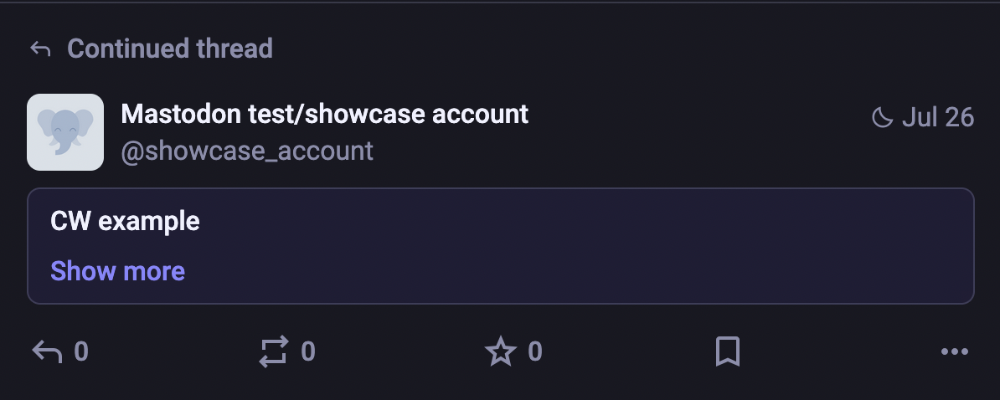
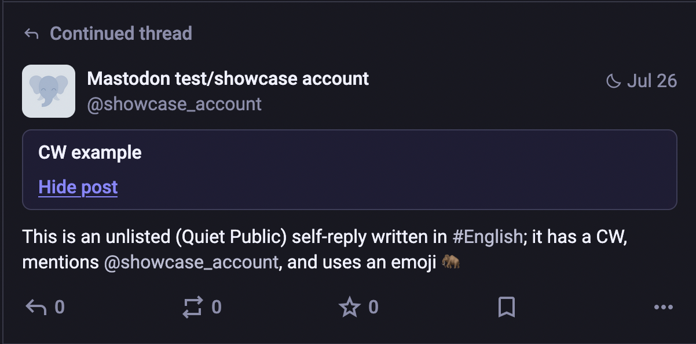

# FEP-4c96: Content Labels

## Summary

In the open social web, a common issue that is faced by people is being able to control what content they do see, and what content they don't. At present the predominant mechanisms for this in the fediverse is the use of "content warnings", which is where the Object (i.e., Note) is created with a `summary` property and the `as:sensitive` property set to true, however, these content warnings only enable the client to collapse the post.

Here is an example of what a "content warning" looks like on Mastodon 4.5, when collapsed (initial state):

And when expanded to reveal the content that was hidden:

The text of the "content warning" can be anything, it doesn't have to be "CW example".

The major drawbacks to this style of content filtering is that:

1. It requires the author of the post to add the content warning when publishing the post. This means that they need to effectively self-censor as their post is subsequentially collapsed by default in their followers' feeds.
2. The only mechanism through which for people to filter by "content warning" is by using filters that match for "does this content warning (or post) contain this word". This may also be a regular expression in some cases. This suffers from the scunthorpe problem, and also breaks when someone uses say "k**tens" instead of "kittens" in their content warning text.
3. The way content warnings were federated in ActivityPub software was to use the `summary` property (Mastodon, June 18 2017, [PR #3844](https://github.com/mastodon/mastodon/pull/3844)), this now causes problems with blogging and publishing platforms wanting to federate Articles with summaries, since a lot of software will render the sheer existence of `summary` as a content warning.
4. The content is always collapsed, unless you opt-out of content warnings all together. Someone cannot currently choose to expand some content warnings but not others. This removes agency of the viewer.
5. Related to point one, the content warning can only be applied but the publishing actor, there isn't really any mechanism through which an third-party can apply a content warning to a post.

To tackle all of these problems, this FEP introduces the notion of Content Labels, which are a structured approach to tagging a post with a label for the explicit purpose of enabling content filtering.

### Content Labels

...

### Collections of Content Labels

...

### Applying Content Labels to ActivityStreams 2.0 Objects

...

## References

- Christine Lemmer-Webber, Jessica Tallon, Erin Shepherd, Amy Guy, Evan Prodromou, [ActivityPub], 2018
- Shel Raphen's article On Content Warnings, [shelraphen-on-cws], 2024
- [Mastodon Pull Request #460](https://github.com/mastodon/mastodon/pull/460), implementing Content Warnings by Blackle, January 12th 2017.

[ActivityPub]: https://www.w3.org/TR/activitypub/
[shelraphen-on-cws]: https://shelraphen.com/on-content-warnings/

## Copyright

CC0 1.0 Universal (CC0 1.0) Public Domain Dedication

To the extent possible under law, the authors of this Fediverse Enhancement Proposal have waived all copyright and related or neighboring rights to this work.
