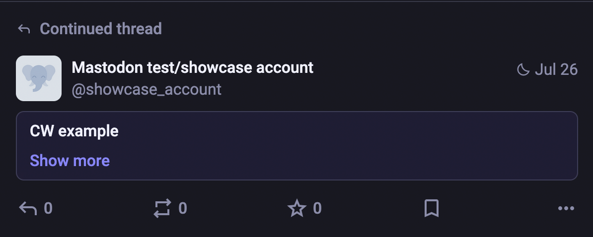
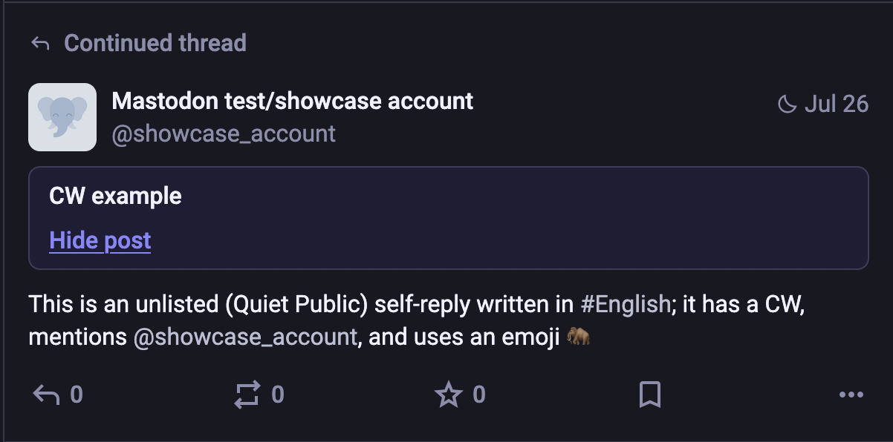

# FEP-4c96: Content Labelling

## Context

In the open social web, a common issue that is faced by people is being able to control what content they do see, and what content they don't. At present the predominant mechanisms for this in the fediverse is the use of "content warnings", which is where the Object (i.e., Note) is created with a `summary` property and the `as:sensitive` property set to true, however, these content warnings only enable the client to collapse the post.

Here is an example of what a "content warning" looks like on Mastodon 4.5, when collapsed (initial state):



And when expanded to reveal the content that was hidden:



The text of the "content warning" can be anything, it doesn't have to be "CW example".

The major drawbacks to this style of content filtering is that:

1. It requires the author of the post to add the content warning when publishing the post. This means that they need to effectively self-censor as their post is subsequentially collapsed by default in their followers' feeds.
2. The only mechanism through which for people to filter by "content warning" is by using filters that match for "does this content warning (or post) contain this word". This may also be a regular expression in some cases. This suffers from the scunthorpe problem, and also breaks when someone uses say "k\*\*tens" instead of "kittens" in their content warning text.
3. The way content warnings were federated in ActivityPub software was to use the `summary` property (Mastodon, June 18 2017, [PR #3844](https://github.com/mastodon/mastodon/pull/3844)), this now causes problems with blogging and publishing platforms wanting to federate Articles with summaries, since a lot of software will render the sheer existence of `summary` as a content warning.
4. The content is always collapsed, unless you opt-out of content warnings all together. Someone cannot currently choose to expand some content warnings but not others. This removes agency of the viewer.
5. Related to point one, the content warning can only be applied but the publishing actor, there isn't really any mechanism through which an third-party can apply a content warning to a post.

To tackle all of these problems, this FEP introduces the notion of Content Labels, which are a structured approach to tagging a post with a label for the explicit purpose of enabling content filtering.

### Rationale

Content Labels exist for two specific purposes: enabling people to filter the content they do and do not wish to see, and enabling service providers to honour age-restriction obligations that apply to them under law. They are not a general-purpose tagging, topic, or organisational system; the `tag` array already supports `Hashtag` and other terms for those purposes.

## Label Definitions

A `LabelDefinition` is the canonical record of a label _term_. It is distinct from a `Label` (the _use_ of a term on a specific object, defined in [Application of Label Definitions](#application-of-label-definitions) below). The split exists so that the application of a label — including who applied it — can carry its own properties without conflating them with the definition of the term itself.

A `LabelDefinition` extends `Object` and is identified by a resolvable IRI. The defining properties are:

| Property                 | Required | Notes                                                                                                                                                           |
| ------------------------ | -------- | --------------------------------------------------------------------------------------------------------------------------------------------------------------- |
| `id`                     | MUST     | Canonical IRI of the label, intended as a persistent identifier. Resolution MUST return the `LabelDefinition` document; the IRI once published MUST NOT change. |
| `type`                   | MUST     | The string `"LabelDefinition"`.                                                                                                                                 |
| `name` / `nameMap`       | MUST     | Short display label, localizable.                                                                                                                               |
| `summary` / `summaryMap` | SHOULD   | One-line description, localizable.                                                                                                                              |
| `content` / `contentMap` | MAY      | Longer-form description, localizable.                                                                                                                           |
| `url`                    | SHOULD   | Human-readable canonical page about the label.                                                                                                                  |
| `context`                | MUST     | IRI of the `Collection` (vocabulary) this `LabelDefinition` belongs to. See [Collections of Label Definitions](#collections-of-label-definitions).              |

### Localisation of Labels

The natural-language properties (`name`, `summary`, `content`) accept either a plain string or, in the `*Map` form, a JSON-LD [language map][as2-language-mapping] keyed by [BCP 47][bcp47] language tags. A vocabulary maintainer publishing labels in a single language SHOULD use the plain form; a vocabulary maintainer publishing labels in multiple languages SHOULD use the `*Map` form. The two forms refer to the same underlying ActivityStreams 2.0 property and may be present together, though this is discouraged.

Publication of label definitions in multiple languages is RECOMMENDED, since ActivityPub serves a multilingual audience and a label is most effective at content filtering when people reading them can understand what they warn about.

#### Example 1 — single-language `LabelDefinition`

```json
{
  "@context": [
    "https://www.w3.org/ns/activitystreams",
    "https://w3id.org/fep/4c96"
  ],
  "id": "https://labels.example/vocab/nsfw",
  "type": "LabelDefinition",
  "name": "NSFW",
  "summary": "Content not suitable for viewing in public or workplace settings.",
  "url": "https://labels.example/docs/nsfw",
  "context": "https://labels.example/vocab"
}
```

#### Example 2 — multilingual `LabelDefinition`

```json
{
  "@context": [
    "https://www.w3.org/ns/activitystreams",
    "https://w3id.org/fep/4c96"
  ],
  "id": "https://labels.example/vocab/nsfw",
  "type": "LabelDefinition",
  "nameMap": {
    "en": "NSFW",
    "de": "NSFW",
    "fr": "Contenu sensible"
  },
  "summaryMap": {
    "en": "Content not suitable for viewing in public or workplace settings.",
    "de": "Nicht für die Anzeige am Arbeitsplatz geeignete Inhalte.",
    "fr": "Contenu non adapté à un visionnage public ou professionnel."
  },
  "url": "https://labels.example/docs/nsfw",
  "context": "https://labels.example/vocab"
}
```

### Behavioural Hints for Labels

> [!NOTE]
> These behavioural hints are subject to change, and the below is a rough draft. The editor of this document will remove this note when the hints reach group consensus.

A `LabelDefinition` MAY also carry additional behavioural-hint properties intended for consuming software:

| Property        | Notes                                                                                                  |
| --------------- | ------------------------------------------------------------------------------------------------------ |
| `severity`      | Suggested severity tier for the label, e.g. `"inform"`, `"alert"`.                                     |
| `blurs`         | What a client SHOULD blur if it chooses to act on the label, e.g. `"content"`, `"media"`, `"nothing"`. |
| `defaultAction` | Suggested default client action, e.g. `"warn"`, `"hide"`, `"ignore"`.                                  |
| `adultOnly`     | Boolean. `true` if the label applies only to adult-restricted content.                                 |
| `selfLabel`     | Boolean. `true` if the label is intended primarily for first-party application.                        |

The behavioural hints above are provisional for the initial draft and may be revised before this FEP is published or converted into a W3C CG Report. Consumers of `LabelDefinitions` are not required to honour these behavioural hints: they are advisory, not normative; a client is free to map any label to any UI behaviour, or to ignore the hints entirely.

## Collections of Label Definitions

A _vocabulary_ of labels is a `Collection` whose items are `LabelDefinition` objects. Whoever maintains the vocabulary publishes the collection of `LabelDefinitions` at a stable URL. Each `LabelDefinition` in the collection points back to it via the `context` property, so that a consumer that encounters an unknown label IRI can resolve it, follow `context`, and discover the vocabulary the label belongs to.

This FEP does not designate a canonical vocabulary; software MUST handle the coexistence of multiple vocabularies.

Label vocabularies that wish to express that two labels from different vocabularies are equivalent, or that one label is broader or narrower than another, SHOULD use the standard JSON-LD / RDF semantics: `owl:sameAs`, `skos:exactMatch`, `skos:broader`, and `skos:narrower`.

These relationships between labels are permitted but not required, vocabularies are valid if they are entirely flat. As outlined in [Rationale](#rationale), relationships between labels and labels themselves are not intended for general taxonomical purposes and MUST NOT be used as such.

### Example 3 - A vocabulary or collection of labels

```json
{
  "@context": [
    "https://www.w3.org/ns/activitystreams",
    "https://w3id.org/fep/4c96"
  ],
  "id": "https://labels.example/vocab",
  "type": "Collection",
  "name": "DTSP Labels",
  "attributedTo": "https://labels.example/actor",
  "totalItems": 2,
  "items": [
    { "id": "https://labels.example/vocab/nsfw", "type": "LabelDefinition" },
    {
      "id": "https://labels.example/vocab/spoiler",
      "type": "LabelDefinition"
    }
  ]
}
```

## Application of Label Definitions

A `Label` is the _application_ of a `LabelDefinition` to an Object: a Note, Article, Video, Actor, etc. A `Label` extends `Link` and is placed inside the `tag` array of the Object it applies to, alongside `Hashtag`s, `Mention`s, and any other tag-like terms.

`Label` extends `Link` so that the canonical AS2 property `href` can carry the IRI of the `LabelDefinition` the application refers to. This is the same pattern as `Mention`, which references an Actor by IRI. Because `tag`'s range already accepts `Link`, no extension to the ActivityStreams 2.0 vocabulary is required.

The properties of a `Label`:

| Property       | Required | Notes                                                                                                                                                                                                          |
| -------------- | -------- | -------------------------------------------------------------------------------------------------------------------------------------------------------------------------------------------------------------- |
| `type`         | MUST     | The string `"Label"`.                                                                                                                                                                                          |
| `href`         | MUST     | IRI of the `LabelDefinition` being applied.                                                                                                                                                                    |
| `name`         | SHOULD   | Inline display label. Implementations MAY pre-populate this from the referenced `LabelDefinition`'s `name` so consumers can render the label without an additional fetch.                                      |
| `attributedTo` | MAY      | Absent (or matching the labelled object's `attributedTo`) for first-party applications. See [Moderator-applied application](#moderator-applied-application) below for the case where this property is present. |

Labels apply uniformly to content objects (Note, Article, Video, Audio, Image, Page) **and** to Actors (Person, Group, Service, Application, Organization). All of these extend `Object` and support `tag`. A `LabelDefinition` does not need to declare which target types it applies to; vocabularies that include labels intended for actor-level use simply include them, and clients decide how to surface them.

> [!NOTE]
> A `LabelDefinition` not defining what it applies to is a TBD which needs group input.

This FEP does not introduce a new "content warning" property. The existing `summary` field and `as:sensitive` flag continue to serve their existing purposes; `Label`s are an additional, structured mechanism and do not replace either.

A `Label` on an `Object` does not carry its own `published` timestamp. The wrapping Activity (`Create` for a new post, `Update` for one that gains or loses labels later) is the authoritative timestamp.

### Labels and User-Agency

A `Label` indicates that a particular `LabelDefinition` applies to the parent Object of the `tag` array it appears in. This FEP does not prescribe how software SHOULD act on that information; that decision belongs to the person reading the labelled content. Software MAY provide some "sensible" defaults that should work for the majority of people using that software, but these defaults MUST be overridable by the person using the software.

Software SHOULD provide each person with the ability to choose how individual labels behave for them. A person MAY, for any given `LabelDefinition`, choose to hide labelled content, blur it, display a warning, or display it without modification — regardless of the vocabulary's [behavioural hints](#behavioural-hints-for-labels), which are advisory rather than normative.

The single exception is moderator-applied behaviour that a service provider is required to enforce on a legal or regulatory basis (for example, an obligation to restrict adult content from minors). The service provider MAY enforce the corresponding behaviour regardless of an individual person's preference; such overrides SHOULD be limited to what the legal obligation requires. Software MAY prevent a person using the software from changing the display setting for a given `LabelDefinition` under this legal basis.

### First-party application

When a `Label` is included in the `tag` array of an Object that the labelled actor publishes (or re-publishes via `Update`), and the `Label` has no `attributedTo` (or its `attributedTo` matches the Object's `attributedTo`), then the `Label` is considered a _self-label_: an assertion by the author that the content should be labelled with the identified label.

#### Example 4 — a Note with a first-party `Label`

```json
{
  "@context": [
    "https://www.w3.org/ns/activitystreams",
    "https://w3id.org/fep/4c96"
  ],
  "type": "Note",
  "id": "https://social.example/notes/abc",
  "attributedTo": "https://social.example/alice",
  "content": "<p>An example post.</p>",
  "tag": [
    { "type": "Hashtag", "name": "#example" },
    {
      "type": "Label",
      "href": "https://labels.example/vocab/nsfw",
      "name": "NSFW"
    }
  ]
}
```

#### Example 5 — an Actor self-labelling

```json
{
  "@context": [
    "https://www.w3.org/ns/activitystreams",
    "https://w3id.org/fep/4c96"
  ],
  "type": "Person",
  "id": "https://social.example/alice",
  "preferredUsername": "alice",
  "tag": [
    {
      "type": "Label",
      "href": "https://labels.example/vocab/adult-content-creator",
      "name": "Adult content creator"
    }
  ]
}
```

### Moderator-applied application

> [!NOTE]
> Until the `moderatedBy` property and associated Moderation Actor is defined, Moderator-applied Labels cannot easily be attributable, unless they are attributed to the [server-level actor](https://codeberg.org/fediverse/fep/src/branch/main/fep/d556/fep-d556.md)

A `Label` MAY also be applied by a moderation actor rather than by the actor or object's creator. The `Label` then carries an `attributedTo` property identifying the moderation actor that applied it. The ActivityStreams 2.0 vocabulary defines `attributedTo` with both `Object` and `Link` in its domain, so no extension is required to carry it on a `Label`.

A consumer SHOULD only honour an `attributedTo` value on a `Label` if it equals the labelled actor's _verified_ moderation actor, as advertised by that actor via the `moderatedBy` mechanism described in the forthcoming `moderatedBy` FEP (ActivityPub Trust & Safety Taskforce [issue #24][issue-24]). A `Label` with an `attributedTo` value that does not match the labelled actor's verified moderation actor is out of scope for this FEP: consumers MAY ignore it for purposes of acting on the label, or treat it as third-party data per [Out-of-band application](#out-of-band-application) below.

Moderator-applied `Label`s travel in the `tag` array of the Object the moderator publishes (typically via an `Update` activity that re-publishes the labelled Object with the added `Label`). Placing the application alongside the content it refers to means that consuming instances see the moderator's label through the same federation paths they already process for `Hashtag` and `Mention`. Delivering moderator-applied labels through an out-of-band channel (for example, a separate annotation inbox) risks consumers not noticing the labelled Object has been moderated; placing the application in `tag` avoids that risk.

The wrapping Activity carries the timestamp of the moderator's action. The `Label` itself does not gain a `published` property.

#### Example 6 — a Note with both a first-party `Label` and a moderator-applied `Label`

```json
{
  "@context": [
    "https://www.w3.org/ns/activitystreams",
    "https://w3id.org/fep/4c96"
  ],
  "type": "Note",
  "id": "https://social.example/notes/abc",
  "attributedTo": "https://social.example/alice",
  "updated": "2026-06-07T12:00:00Z",
  "content": "<p>An example post.</p>",
  "tag": [
    { "type": "Hashtag", "name": "#example" },
    {
      "type": "Label",
      "href": "https://labels.example/vocab/nsfw",
      "name": "NSFW"
    },
    {
      "type": "Label",
      "href": "https://labels.example/vocab/spoiler",
      "name": "Spoiler",
      "attributedTo": "https://social.example/moderation"
    }
  ]
}
```

### Out-of-band application

A `LabelDefinition` can also be applied to an `Object` out-of-band, for example, by a third-party annotation service that did not publish the `Object` being labelled and therefore cannot include a `Label` in its `tag` array. This case is out of scope for this FEP and is expected to be addressed by a follow-up FEP based on the W3C [Web Annotation Data Model][web-annotation].

## References

- Christine Lemmer-Webber, Jessica Tallon, Erin Shepherd, Amy Guy, Evan Prodromou, [ActivityPub], 2018
- James M Snell, Evan Prodromou, [Activity Vocabulary][as2-vocab], 2017 — used here for `Link`, `tag`, `attributedTo`, and `href` definitions.
- Evan Prodromou (editor), [ActivityPub Miscellaneous Terms][as-sensitive], SWICG CG-DRAFT — source for the [`as:sensitive`][as-sensitive] property referenced in the Summary and §[Application of Label Definitions](#application-of-label-definitions), and for the [`Hashtag`][as-hashtag] type used in `tag` examples throughout.
- Shel Raphen's article On Content Warnings, [shelraphen-on-cws], 2024
- [Mastodon Pull Request #460](https://github.com/mastodon/mastodon/pull/460), implementing Content Warnings by Blackle, January 12th 2017.
- FediMod FIRES, [Labels protocol reference][fires-labels], 2025.
- W3C Web Annotation Working Group, [Web Annotation Data Model][web-annotation], 2017 — referenced for the forthcoming out-of-band label-application FEP.
- ActivityPub Trust & Safety Task Force, [Issue #24: Addressing for moderation activities / discovery of an actor's moderators][issue-24] — tracks the in-progress `moderatedBy` mechanism that this FEP depends on for verifying moderator-applied `Label`s.

[ActivityPub]: https://www.w3.org/TR/activitypub/
[as2-vocab]: https://www.w3.org/TR/activitystreams-vocabulary/
[as-sensitive]: https://swicg.github.io/miscellany/#sensitive
[as-hashtag]: https://swicg.github.io/miscellany/#Hashtag
[as2-language-mapping]: https://www.w3.org/wiki/Activity_Streams/Primer/Language_mapping
[bcp47]: https://www.rfc-editor.org/info/bcp47
[shelraphen-on-cws]: https://shelraphen.com/on-content-warnings/
[fires-labels]: https://fires.fedimod.org/reference/protocol/labels.html
[web-annotation]: https://www.w3.org/TR/annotation-model/
[issue-24]: https://github.com/swicg/activitypub-trust-and-safety/issues/24

## Copyright

CC0 1.0 Universal (CC0 1.0) Public Domain Dedication

To the extent possible under law, the authors of this Fediverse Enhancement Proposal have waived all copyright and related or neighboring rights to this work.
